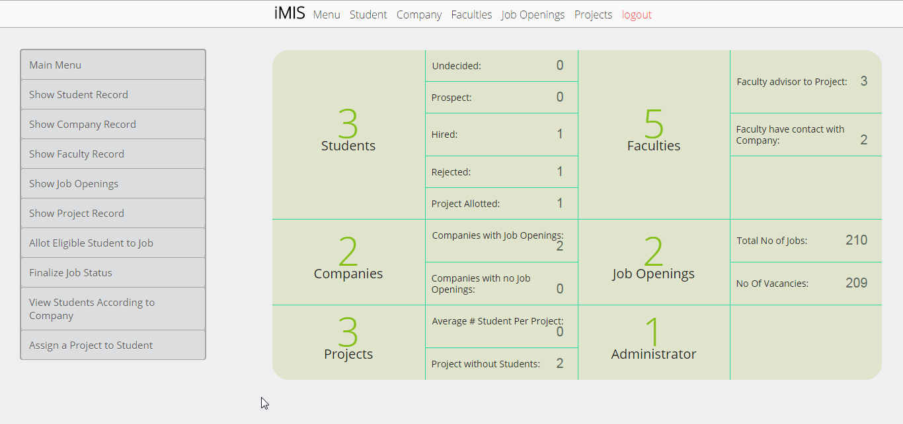
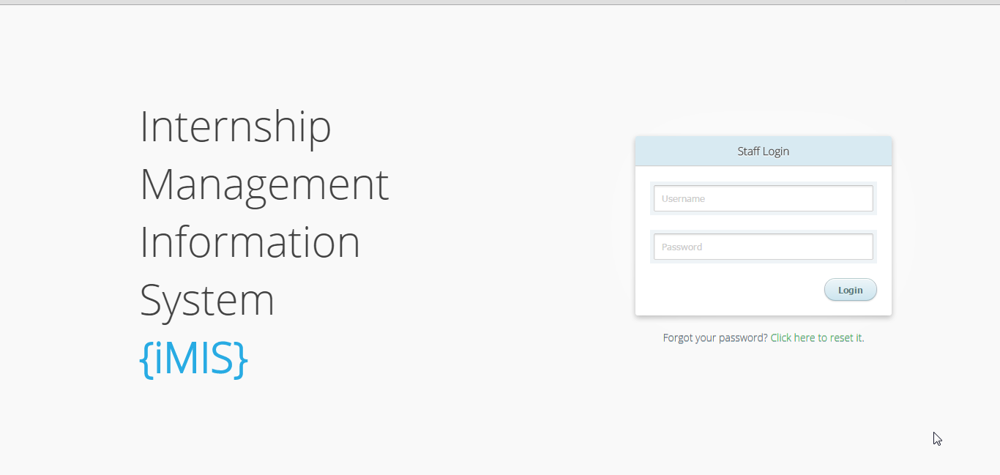

# iMIS

####Internship Management Information System

#####About it
IMIS is a web based application. It keeps track of the student’s internship progress: from application to internship completion. It also keeps track of the progress for the rest of the students who do not follow the internship route and instead they are assigned a project with a faculty member or start their own company. Admin manages all the operations of it.

#####Screenshot

Main Page

Login Page

